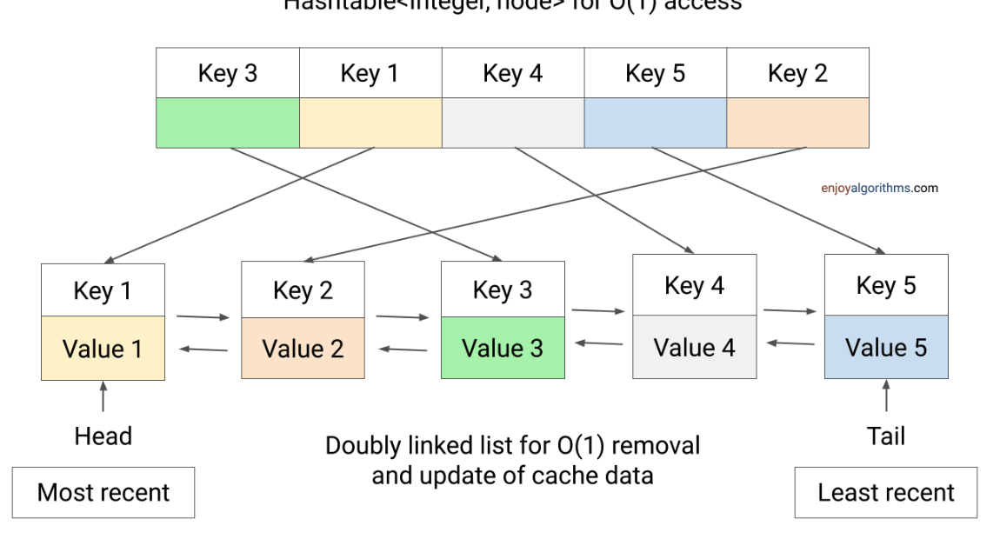
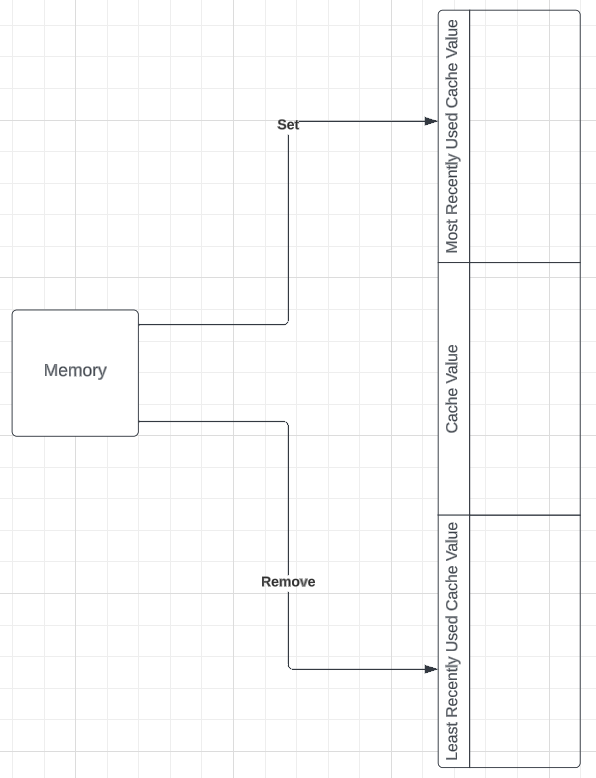
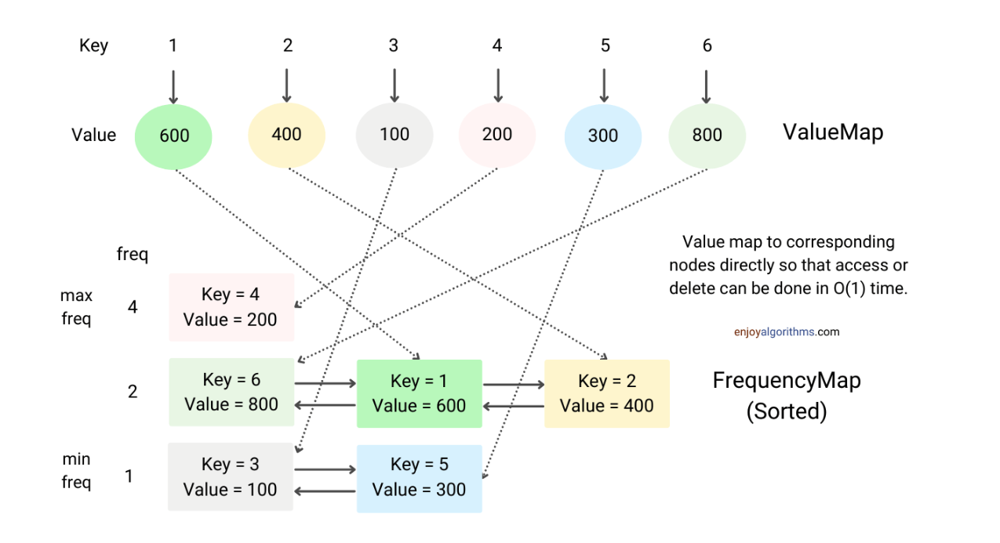
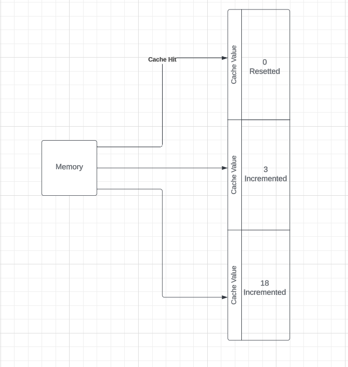
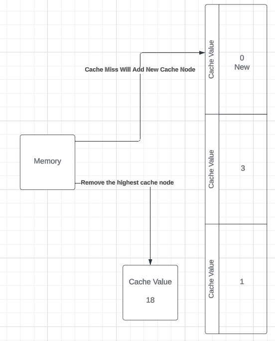

# Caching Mechanisms

This document provides an overview of different caching mechanisms and their use-cases.

## 1. LRU Cache (Least Recently Used)



LRU cache discards the least recently used items first when the cache's capacity has been reached. This algorithm uses the idea that the items which have been used recently will likely be used again soon.



Use cases:

-   Database and application caches, where recency could be an indicator of relevance
-   CPU caches
-   In a scenario where temporal locality is present i.e., recently accessed items are likely to be accessed in the near future.

## 2. LFU Cache (Least Frequently Used)



LFU counts how often an item is needed. Those that are used least often are discarded first. This algorithm uses the idea that frequently accessed items will likely be accessed again.

In case of a cache hit



In case of a cache miss



Use cases:

-   Database and application caches, where frequency could be an indicator of relevance.
-   In a scenario where the most popular items should stay in cache, such as a web server caching the most visited web pages.

## 3. FIFO Cache (First In First Out)

FIFO is a very simple cache strategy where the oldest (first) entry added to the cache is the first one to be removed when the cache's capacity has been reached. It does not consider how often or how many times it has been accessed in the past.

Use cases:

-   In simple scenarios where the data doesn't have any temporal or frequency patterns.
-   Caching of immutable/static data which does not change often.

## Cache Usage with Axios HTTP Client

Our Axios HTTP client implementation uses these caching mechanisms to cache the responses of HTTP requests. This can significantly speed up the application by reducing the number of network calls and serving the data from the cache when available.

Here's a basic example of how the HTTP client uses a cache:

```
const cache = new LRUCache<string, any>(100); // Creates a new LRUCache with capacity of 100 items
const httpClient = new Axios(cache); // Creates a new Axios instance with the cache

// To make an HTTP request and cache the response
const response = await httpClient.request({method: 'GET', url: 'path/to/resource'});
``` 